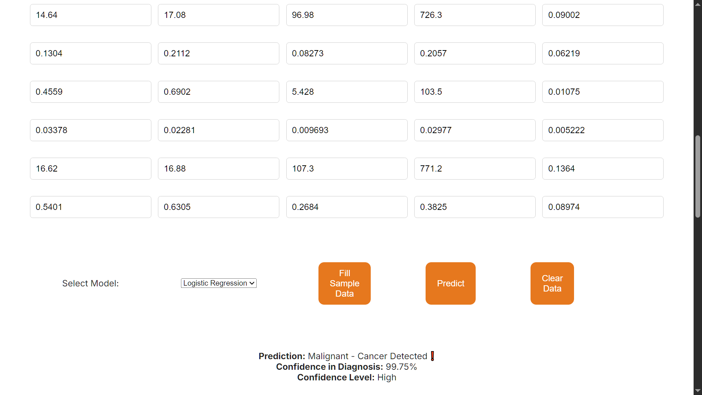

# 🩺 Breast Cancer Detection using Machine Learning

This project is a full-stack machine learning application that predicts whether a breast tumor is **malignant** or **benign** based on 30 medical diagnostic features. It includes a trained classification model, a web interface using **Flask**, and detailed exploratory analysis in a Jupyter notebook.


---

## 📂 Project Structure

- `data/`: Contains datasets used for training/testing.
- `model/`: Stores the trained ML model(s).
- `reports/`: Includes evaluation metrics, graphs, and prediction.
- `statics/`: Frontend static assets (CSS).
- `templates/`: HTML templates used by Flask for rendering.
- `app.py`: Flask application that connects frontend with the ML model.
- `requirements.txt`: List of required Python libraries.
- `README.md`: Project overview and instructions.


---

## 🔍 About the Dataset

- **Name**: Breast Cancer Wisconsin (Diagnostic) Dataset
- **Source**: [UCI Machine Learning Repository](https://www.kaggle.com/datasets/uciml/breast-cancer-wisconsin-data)
- **Features**: 30 numerical features related to cell nuclei characteristics (e.g., radius, texture, concavity, symmetry)
- **Target**: `Diagnosis` — Malignant (M) or Benign (B)

---

## 🧠 Machine Learning Model

- **Algorithm Used**: Logistic Regression / SVM / Decision Tree *(choose the correct one you used)*
- **Preprocessing**:
  - StandardScaler for normalization
  - Train-test split (80/20)
- **Model Evaluation**:
  - Accuracy Score
  - Confusion Matrix
  - ROC-AUC Curve
- **Final Accuracy**: *97.3%* on test data

---

## 🌐 Web Application

Built using **Flask**, this app allows users to input 30 numerical values and get a real-time prediction of the diagnosis.

### Features:
- Input form for all 30 features
- Model prediction: `Malignant` or `Benign`
- Simple and clean UI

---

## 🚀 How to Run This Project

### ✅ Prerequisites
- Python 3.8+
- pip

### 🛠️ Setup Instructions

```bash
# Clone the repository
git clone https://github.com/yourusername/breast-cancer-detection.git
cd breast-cancer-detection

# Create a virtual environment (optional but recommended)
python -m venv venv
source venv/bin/activate  # or venv\Scripts\activate on Windows

# Install dependencies
pip install -r requirements.txt

# Run the Flask app
python app.py


📊 Exploratory Data Analysis (EDA)
The notebook.ipynb includes:

Data cleaning

Distribution visualizations using Seaborn/Matplotlib

Correlation heatmap

Feature selection techniques

Model training, evaluation, and tuning




📦 Dependencies
Generated using pip freeze > requirements.txt, but some key packages:

Flask

scikit-learn

pandas

numpy

matplotlib

seaborn

joblib

🙋‍♂️ Author
Name: Md Faiz Alam

GitHub: https://github.com/Md-Faiz-Alam

LinkedIn: https://www.linkedin.com/in/alammdfaiz/
